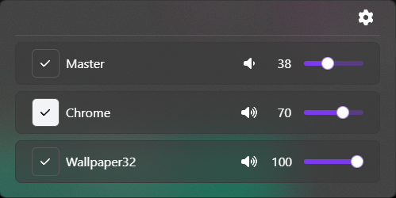
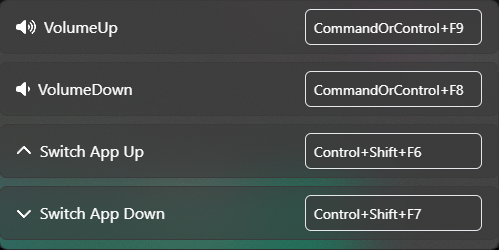

# AudioMixer

Um projeto simples de um Audio Mixer para Windows, Feito para simplificar o controle dos volumes das aplicações reproduzindo áudio no momento.

## Funcionamento

### Controlar volumes
Para aumentar ou diminuir o volume, utilize os atalhos correspondentes. O aplicativo permite controlar uma aplicação por vez; para mudar de aplicação, pressione o atalho correspondente a Switch App Up ou Switch App Down. Os atalhos podem ser configurados para outras combinações de teclas.

***Observação: Evite configurar atalhos e teclas que já possuam funções dentro do Windows. Esses atalhos podem deixar de funcionar para dar lugar às funcionalidades específicas deste aplicativo. Certifique-se de usar apenas atalhos únicos e exclusivos dentro do aplicativo para evitar conflitos e garantir o seu funcionamento correto.***

 
